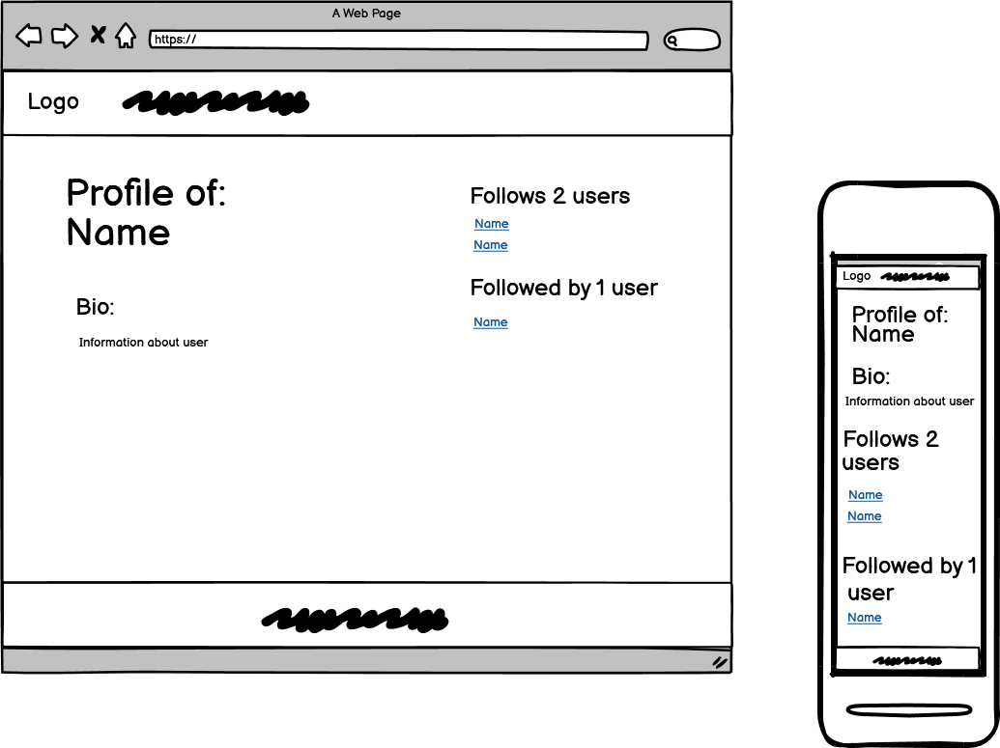

[View the site live here!](https://musicians-blog-a58fa5a0530b.herokuapp.com/)

# Musician's blog

Musician's blog is a social blog aimed for users that are interested in anything and everything related about music.

Here, users can read blog posts about instruments, songs, or other fascinating topics of the musically inclined.
They can comment on posts, create their own profiles with bios and also follow other users' profiles to become more engaged with the blog's community.

The blog is based of Code Institute's CodeStar Blog, which is a full stack project built using the Django Framework.
The follow and profile functionalities are heavily inspired from the Youtube channel 'Codemy.com' and their series called 'Django Wednesdays Twitter'
The follow and profile functionality follows from 'Django Wednesdays Twitter #1' to 'Django Wednesdays Twitter #6'

## Features

### Existing Features

- **Navigation Bar**
  
  - Featured on all pages. Includes links to logo, Home, About, (Register, Login) or Logout, Profiles, My Profile and is the same on each page for easy navigation.
  - Users are displayed as logged in at the top right corner. (Otherwise it will display: "You are not logged in, click 'here' to log in.", in which 'here' links to the login page)

- **Footer**
  
  - Featured on all pages. The icons don't have any links since this blog currently doesn't have any other social presence.

- **Homepage**

  - The homepage is the first page the user will encounter. It displays a list of blog posts with their titles, publication dates, and author details. Each post is represented as a card containing brief information and a link to read more.
  - The navigation bar provides links to essential sections like Home, About, Register and Login.
  - To access more functionalities like commenting on posts or clicking on authors'/users' links to view their profiles, the user has to register and be logged in.
  - If the user is logged in, the navigation bar provides links to essential sections like Home, About, Logout, Profiles and My Profile.
    - Logged in users can comment on posts, and they can also click on authors' or commenters' names, in which it will lead to that user's profile page.
  - The blog posts' titles serve as clickable links that direct users to detailed view of the blog post.
  - Pagination allows users to navigate through multiple pages of blog posts.

- **About**

  - The About page showcases a combination of text (right side) and an accompanying image (left side) and is used to convey the essence of the blog, its objectives, and its focus on various aspects of music.
  - The About page shows when it was last updated.
  - **Collaboration Form:** Users are encouraged to collaborate or reach out through a form present on the page.

- **Register, Login and Logout**

  - Allows the user to register and make an account. The authentication functionalities are powered using Django's allauth package.
    - **Register:** Users can create an account by registering through the provided registration form.
    - **Login:** Registered users can log in using their credentials via the login form.
    - **Logout:** Allows logged-in users to sign out securely from their accounts.

- **Profiles**

  - It is a profile list. It Displays the total count of profiles excluding the current logged in user's profile. The profiles are ordered by names in alphabetical order.
  - Each profile entry consists of:
    - **Username:** Displayed as the card title.
    - **Profile Creation Date:** Shows when the profile was created.
    - **View Profile Button:** Redirects to the individual user's profile page.

- **Profile / My profile**

  - The profile of another user / (Or the logged in user's own profile).
  - Here the user can read a bio about the user.
  - They can choose to follow or unfollow the specific user by a button (Unless they are on their own page. Then the follow button won't be available for them to follow themselves).
  - See how many and who they follow.
  - See how many and who they are followed by.

### Features Left to Implement

- Blog posts and comments made by a user to show up on their profile page.
  - **Reasons**: Lack of current knowledge and time.

- Implement like system for blog posts and see amount of likes. Allowing users to give positive feedback to posts.
  - **Reasons**: Lack of time.

## User Experience - UX

The design and functionalities of the website is based around user stories and agile methodology.

### User Stories

The user stories are accessible in the Musician's Blog User Stories project
<https://github.com/Masorr/musicians_blog/projects?query=is%3Aopen>

- Epic: Posts
  - #1 As a site user I can view a paginated list of posts so that I can select which post I want to read
  - #2 As a site user I can click on a post so that I can read the post's content
  - #3 As a site admin I can create, read, update and delete posts so that I can manage my blog content
  - #8 As a site admin I can create draft posts so that I can finish writing the content later

- Epic: About Page
  - #11 As a site admin I can create and update the About information so that I can make it available to users
  - #12 As a site user I can click on the About link so that read more about the site

- Epic: Collaboration Requests
  - #13 As a potential collaborator I can fill in a contact form so that I can submit a request for collaboration
  - #14 As a site owner I can store collaboration requests in the database so that I can review them
  - #15 As a site owner I can mark collaboration requests as 'read' so that I can see how many I still need to process

- Epic: Comments
  - #5 As a site user I can leave comments on a post so that I can be involved in the conversation
  - #6 As a site user / admin I can view the comments on an individual post so that I can read the conversation
  - #7 As a site user I can modify or delete my comments on a post so that I can be involved in the conversation
  - #9 As a site admin I can approve or disapprove comments so that I can filter out objectionable comments

- Epic: User Accounts and Profiles
  - #4 As a site user I can create/register an account so that I can comment on a post
  - #10 As a site user I can choose to follow another user so that I can become more involved with the community
  - #16 As a site user I can visit other users' profiles so that I can become more engaged with the community

## Design

- Since the blog is based off Code Institute's CodeStar blog project. The design retains this style.
- Only wireframes available are for the new additions. Two of which are profile list page and the profile page.
- The ERDS show already established models in the CodeStar blog as well as new.
- The new models here are: **Profile**

- **Wireframes**

  - 
  - 

- **ERD (Entity Relationship Diagrams)**

  - 

- **Colours**

  - There are mainly 4 prevalent colour types.
  - Light grey (most common). Mostly used as background.
  - Dark grey (common). For footer, post texts and also to make some contrasting styles.
  - Greenish (uncommon). Used mostly for buttons or actions the user can perform.
  - Orange (rare). Used on some buttons.

## Testing

### Manual Testing

### Validator Testing

- HTML
  - No errors were found when passing through the W3C HTML validator: <https://validator.w3.org/>

- W3C HTML validator results for HTML pages.

  

- CSS
  - No errors or warnings were found when passing through the W3C CSS validator: <https://jigsaw.w3.org/css-validator/>

- W3C CSS validator result for style.css.

  

- JavaScript
  - One 'error' was found when passing through the JSHint validator: <https://jshint.com/>

- JSHint validator result for javascript file comments.js

  

  - It states in comments.js that 'bootstrap' is an undefined variable.
  - However, it is because jshint doesnt recognize bootstrap within the jshint 
  environment in the base.html, of which post_details.html extends from (post_details.html uses comments.js)
  - We can find the bootstrap javascript library, below in base.html
    <!-- Bootstrap CSS -->
        <link
        href="https://cdn.jsdelivr.net/npm/bootstrap@5.0.1/dist/css/bootstrap.min.css"
        rel="stylesheet"
        integrity="sha384-+0n0xVW2eSR5OomGNYDnhzAbDsOXxcvSN1TPprVMTNDbiYZCxYbOOl7+AMvyTG2x"
        crossorigin="anonymous"
        />
  - Therefore, this is not really an error.

- Python
  - No errors or warnings were found when passing through the PEP8 python validator: <https://pep8ci.herokuapp.com/>

- PEP8 validator result for python files in musiciansblog project, blog app and about app.

  

### Media

- Tested on Microsoft Edge, Mozilla Firefox and Chrome.
- Screen media mockup tested on <https://ui.dev/amiresponsive?url=https://musicians-blog-a58fa5a0530b.herokuapp.com/>
- Tested on desktop, laptop and mobile.

### Fixed Bugs

- When attempting to make a follow model. A few models were made, migrated and then scrapped. The coder then wanted to update model in profile without doing python3 manage.py blog zero. This was in order to keep the blogs and comments as the coder did not want to loose data.
- <https://www.postgresql.org/docs/current/sql-droptable.html> by following these steps. The coder went into the database server (elephantSQL) and took took DROP TABLE blog_profile_follows and blog_profile.
- When attempting to make new migrations and migrate, no changes were made.
- Coder then attempted to run python3 manage.py migrate blog 0006 to revert to previous migration, error came up
	django.db.utils.ProgrammingError: table "blog_profile_follows" does not exist. This was because in order to revert back to a previous migration, the tables in elephantsql were needed to be able to revert back, even python3 manage.py blog zero didn't work.
  - Bug was fixed when coder ran python3 manage.py sqlmigrate blog 0007 to see the SQL code tables generating for elephantSQL. (These include the tables that were wrongly removed from the database). They were then re-added according to <https://www.postgresql.org/docs/current/sql-createtable.html>
  - The tables were remade for elephantSQL by running
    - CREATE TABLE "blog_profile" ("id" bigint NOT NULL PRIMARY KEY GENERATED BY DEFAULT AS IDENTITY, "bio" text NOT NULL, "created_on" timestamp with time zone NOT NULL, "user_id" integer NOT NULL UNIQUE);
    - CREATE TABLE "blog_profile_follows" ("id" bigint NOT NULL PRIMARY KEY GENERATED BY DEFAULT AS IDENTITY, "from_profile_id" bigint NOT NULL, "to_profile_id" bigint NOT NULL);
    - When these were readded to the database, the coder could run python3 manage.py migrate blog 0006 to modify the models without having to reset all migrations and preventing unnecessary loss of data.

### Unfixed Bugs

- There are no known unfixed bugs.

## Deployment

- The site was deployed to Heroku:
  - Create a new Heroku app.
  - Add config var for Cloudinary: 'CLOUDINARY_URL' and value: 'your cloudinary api key'.
  - Add config var for database: 'DATABASE_URL' and value: 'your postgres database url'.
  - Add config var for secret key: 'SECRET_KEY' and value: 'your secret key'.
  - Go to deploy, select deployment method (GitHub).
  - Search for 'musicians_blog' in app to connect to GitHub and connect the repository to Heroku.
  - Hit 'deploy branch' at bottom of page.
  - Select 'Open app' at the top of the page.

Link to live site - <https://musicians-blog-a58fa5a0530b.herokuapp.com/>

- Cloning the Repository:
  - On the repository page, click the 'Code' box.
  - Pick local then HTTPS and copy the link that is shown, which is: <https://github.com/Masorr/musicians_blog.git>
  - Open the terminal in your code editor and specify the directory you want to have your clone.
  - Type 'git clone' into your terminal and paste the link <https://github.com/Masorr/musicians_blog.git> and hit enter.

## Credits

### Content

- The base of the blog comes from Code Institute's CodeStar blog walkthrough project. This most of the functionality of the website. Including home page, pagination of posts, commenting and its CRUD functionality. Login functionality and registering of users and the about page.
- The profiles, my profile and following of users are credited and heavily inspired to Codemy.com and their Youtube channel <https://www.youtube.com/@Codemycom>. Especially their videos, from 'Django Wednesdays Twitter'. Going from 'Django Wednesdays Twitter #1' to 'Django Wednesdays Twitter #6'.
- Ordering of profiles comes from <https://docs.djangoproject.com/en/5.0/ref/models/expressions/>

### Media

- All images were taken from pexels.com <https://www.pexels.com/>
  - images by ROMBO <https://www.pexels.com/@rombo-1510555/>
    - workspaces/musicians_blog/static/images/default.jpg
  - images by Pixabay <https://www.pexels.com/@pixabay/>
    - workspaces/musicians_blog/static/images/image-about.jpg

## Thanks

- I want to thank Code Institute and their tutors for their program and lessons, and giving me the opportunity to learn by myself by coding this full stack blog website using the django framework.
- I want to thank Codemy.com and their excellent youtube tutorials.
- I want to thank the Slack community and my mentor Dick Vlaanderen for feedback and inputs.
